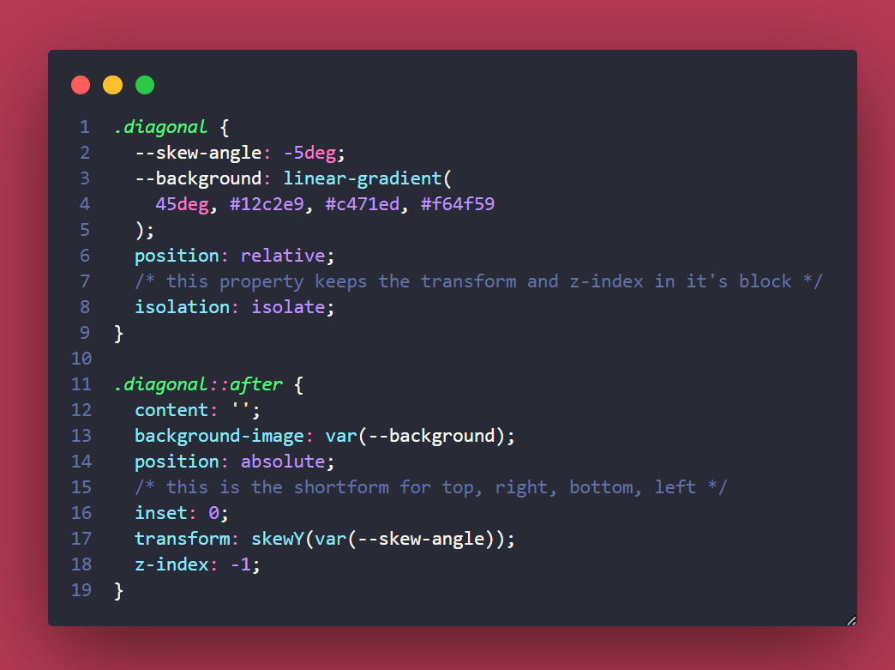

# Notes on Creating Section Creative Backgrounds

I've been learning a lot, taking so many classes, and 💯 upping my skills... But my extreme-let's-go-regime has me running on fumes. 😶‍🌫️ 

So happy, fun break-time! 

I open up **YouTube** and what do I see first?  A **Kevin Powell** video offering me feel-good CSS time. 💗

Check out his [Spice up your site | Easy waves, angles & other creative shapes with CSS video on YouTube](https://www.youtube.com/watch?v=hWGgw1K-i8Y) for yourself.

These notes are my hope to remember the steps myself... 😂

## The Designs

### TheDiagonal Design


- Use a class of _.diagonal_ on the section to style up.  For funsies, set the linear gradient to enjoy yourself while applying your CSS magic!
- Create the _transformation_ on the *pseudo-element*, either `::before` or `::after` - dealer's choice.
- Remember to add the oh so necessary pseudo-element property: `content: '';`.
- Slap whichever background colour you choose, so it'll show your step-by-step work.
- Set up `position`; `absolute` on the selector, we're working on, and `relative` on it's containing block.
- Back to the pseudo-element (_I think this is getting over-used, so henceforth it will be known as the *PE*_), we'll use the `top`, `right`, `bottom`, and `left` shortcut of `inset: 0;`.
- Now for the angle: `transform: skewY(-5deg);`.
- Finally, change the `z-index: -1;` to lower it underneath the block's content and copy over the `.diagonal`'s background code.

The super-cool new thing I learned was `isolation: isolate;`, which you can apply to the element itself, so the *transform* and *z-index* stay within this containing block.

A *dev-friendly* tip was to use custom properties for the transform angle and background, so you don't need to scroll through all the kind to see what's happening!



### Let's Get Spikey!

Kevin went with the spikey name here, but I managed more of what I'd call **The Fringe**.  Either way this was simply an awesome effect!


- As per usual set up a `.spikes` class with `position: relative;`, but then set up some basic styles for both a _before_ and _after_ PE.  
- On both PE's set uo a ```CSS
width: 100%;
height: 50px;
```