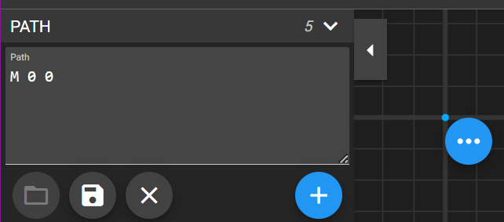

# Notes on Section Creative Backgrounds

I've been learning a lot, taking so many classes, and 💯 upping my skills... But my extreme-let's-go-regime has me running on fumes. 😶‍🌫️ 

So happy, fun breaktime! 

I open up **YouTube** and what do I see first?  A **Kevin Powell** video offering me feel-good CSS time. 💗

Check out his [Spice up your site | Easy waves, angles & other creative shapes with CSS video on YouTube](https://www.youtube.com/watch?v=hWGgw1K-i8Y) for yourself.

These notes are my hope to remember the steps myself... 😂

## The Designs

### The Diagonal 🪃


- Use a class of _.diagonal_ on the section to style up.  For funsies, set the linear gradient to enjoy yourself while applying your CSS magic!
- Create the _transformation_ on the *pseudo-element*, either `::before` or `::after` - dealer's choice. 🃏
- Remember to add the oh so necessary pseudo-element property: `content: '';`.
- Slap whichever background colour you choose, so it'll show your active transforms.
- Set up `position`; `absolute` on the selector, we're working on, and `relative` on it's containing block.
- Back to the pseudo-element (_I think this is getting over-used, so henceforth it will be known as the **PE**_), we'll use the `top`, `right`, `bottom`, and `left` shortcut of `inset: 0;`.
- Now for the angle: `transform: skewY(-5deg);`.
- Finally, change the `z-index: -1;` to lower it underneath the block's content and then copy over the `.diagonal`'s background code.

The super-cool new thing 💎 I learned was `isolation: isolate;`, which you can apply to the element itself, so the *transform* and *z-index* stay within this containing block. It does this by creating an **independent stacking context**.

A *dev-friendly* tip was to use custom properties for the transform angle and background, so you don't need to scroll through all the code to see what's happening!


### Let's Get Spikey! 😖

Kevin went with the spikey name here, but I managed more of what I'd call **The Fringe**.  Either way this was simply an awesome effect!


- As per usual set up a `.spikes` class with `position: relative;` and a linear gradient, but then set up some basic styles for both a _before_ and _after_ PE.  
- On both PE's set up a 
```CSS
content: '';
position: absolute;
width: 100%;
height: 50px;
background: purple;
```
Usually they'd automatically have a full width, but the absolute positioning changes that.  The height is pretty much guess work.  The purple will show you where we're working.


- Now move them all the way to the top and bottom individually with the `top` and `bottom` properties.

- Use [SVG Path Editor](https://yqnn.github.io/svg-path-editor/) to create `triangle.svg`.
- Click on the blue plus circle and select **Move to** for our starting point.

- If necessary, move the blue dot so the coordinates are `M 0 0`.

- Click the blue plus circle under Path, identified as **Append new command** on hover, then choose **Line to**.  

- Move to the `L 10 0` coordinates.

- Choose **Line to** again and make an equalateral triange, say `L 5 5`.
- To close it off, at the bottom of the **Append new command** menu, choose **Close path**.
- To the top right of the window, choose **Download as SVG**.  

- In the popup window, the colour isn't important, but **do ensure it isn't set to Stroke**!

- Add the file to a new folder in your file structure.
- **Back to the CSS...**
- Add a **mask-image** to the combined style rules for both PE's.  As of _Feb 2023_, **Chrome** still needs this to be prefixed.  `-webkit-mask-image: url('img/triangle.svg');`.  It will cut out certain sections of the triangle and masks it along the way, and repeats all the way across.

- Change the bottom ones with `transform: rotate(.5turn)` on the bottom PE.

- Remember that we set the background to purple, so everything where the image is is getting 'masked' away.  Next we can manipulate their height and width.
- But let's deal with the **aspect-ratio** first.  SVG's will always preserve this.  In the `triangle.svg` file, add `preserveAspectRatio="none"` in the `svg` tag.  That will allow the svg to be stretched and squished.

- With this setting our purple image mask will look like this:

- **Warning:**  The image mask won't really work with a background linear gradient image on the entire page, ie - on the body.  It's fine on the section, but there could be issues.
- So... To make it a little easier, you can set up a custom property on the root for the page's background colour then use that on the _spike PE's_, like on lines 73 and 87 in the code below.
- Now you can manipulate the spikes with the **mask-size** property, which will take width and height values. So playtime! If the height here is different than the PE's height there could be repeating issues.  But you could use custom properties to simplify control.


**But be aware:**  Using a `transform` and a `rotate` on the bottom PE could cause issues if the user zooms in on the page.  It's a rendering issue that could cause it to look messy!  _To solve this, you could make a separate svg image for the bottom._

- Also remember to copy and paste all the mask properties without the prefix!

### Getting Wavy 🌊

**Note:** This method _could_ be used for the spikes, but your control over the final effect would be lessened.
